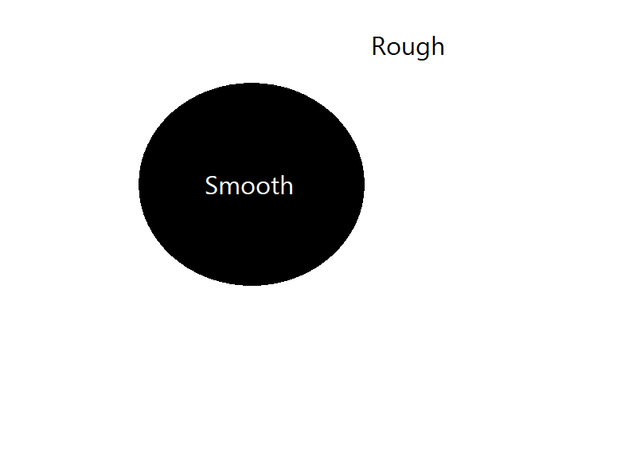

# 2020-Summer-Research Project
UON Summer Research Project - Facilitating learning for visually-impaired students using a haptic screen

# Background

The haptic device currently takes in an image that produces a static feel of friction which allows a visually-impaired user to sense the different colors in the images. The problem with the device lies in its processing and outputting the image. The static friction does not provide an intuitive description to the user, but in an "inverted manner".

For instance, imagine an image of a black filled colored circle with a white background. When the device takes in the image, the friction will be produced on the white background while the black filled circle has a smooth feel where there is no friction at all.



Intuitively, the white background should be smooth while the dark black circle should be producing the highest friction. We also wanted the friction level to vary as the color changes too.


The purpose of the application is to produce an inverted image and integrate it with the haptic device so that it can produce a desirable static projection to the input-image.


# Functionality of the Application

The application will takes an image in JPG, PNG and BMP and will perform the following functions:

 1. Invert the image
 2. Change the level of contrast of the image
 3. Zooming the image
 4. Enlarge the resolution of the image
 5. Enlarge the pixel of lines/graphs in the image assuming that the background is white (i.e making the line/graphs more bold)

# Input

The application will read the input from a textfile named "config.txt" where the input consists of

 1. The name of the image in JPG, PNG and BMP
 2. An integer that controls the level of whiteness of the image. 

	Whiteness Level: 0 =< int < 6

 3. A float that tells how far the level of the zoom should be. 

	Zooming in: float > 1.0 e.g 1.3
	No Zoom: float = 1.0
	Zooming out: 0.0 < float < 1.0 

 4. An float that tells how large the resolution should be.

	Increase: float > 1.0 e.g 1.3
	No changes: float = 1.0
	Decrease: 0.0 < float < 1.0 e.g 0.8

 5. An integer that tells how large the bold should be. 
	
	No Bold: int = 0
	Bold Level: int > 0

	**Note: The bold level input will depend on the images i.e some images may require a higher number than others.
 

# Compile and Run the Application

Once the textfile is filled with relevant information, the application can be executed from the command prompt/terminal screen that takes in an argument which is the text file name.

The following command will allow you to run and compile the application

```
javac MyCanvas.java
java MyCanvas config.txt
```

